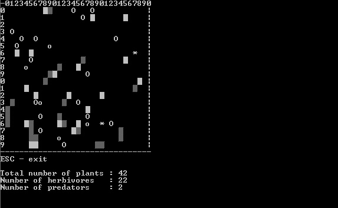
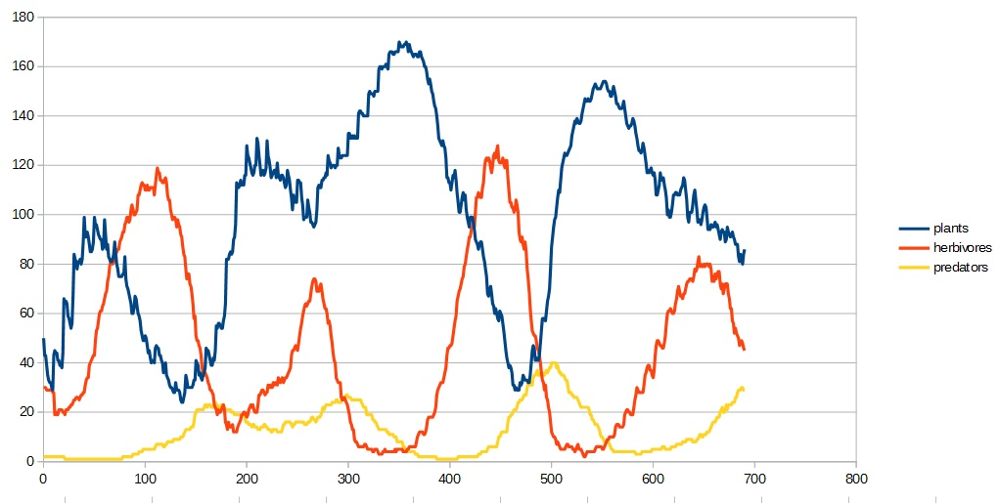

# Ekosystem
Watch how organisms of three species live, are born and die in 2D space of console window.

## The idea
When I was learning C++ language, especially object oriented programming, at some point I decided to write a bigger project than simple exercises. An association to objects in C++, that appeared in my mind, were living creatures. Therefore I decided to make use of my fresh programming knowledge by creating an application where the objects would go through their life cycle in a mass scale like animals and plants in the real world.

## Screenshots

## Technologies
* C++11
* Visual Studio 2017
* Standard library

## Features
* Three types of organisms: plants, herbivores and predators try to survive and reproduce themselves in 2D, text-character world.
* User can modify almost all variables that have influence on life of the organisms.
* Application writes organisms number in each time step in a .csv file - you can later open it in a spreadsheet application and make e.g. graph.

## Setup
Windows, 64 bit systems: download and unpack .zip file from the repository main folder, run ekosystem64.exe. If it does not work, you may need to download and install the Visual Studio 2017 C++ redistributable (x64):

https://aka.ms/vs/15/release/vc_redist.x64.exe

but the 2015 version should also be sufficient

## How to use
After running .exe file, all you need to do is to type in the initial number of particular organisms. At that step you see also how they will be represented in the simulation. Then the simulation starts and you can watch the scene.

Plants grow and from time to time spread themselves to adjacents map fields, if they are free. To not 'imprison' animals, you can set a maximum percentage limit of map that they can occupy.

Herbivores walk through the map in a random way and eat plants if they find any on an adjacent field. If a herbivore is full, it hides itself so the predators cannot see it. Hidden herbivore is shown as 'o' (lowercase). The herbivores cannot eat plants on rocks - the rocks are safe place for plants and from there they can spread to a non-rock ground.

Predators also go through the map in an accidental manner. They eat herbivores and cannot hide (there is no point for them).

Both Predators and herbivores have a parameter 'condition' that rises when eating and slowly decreases over time. When it reaches zero, the animal dies. Then, for one time step, a cross appears at the place it died. A herbivore also dies when it becomes a dish of a predator. At certain time intervals, when an animal is in good condition, it gives birth to a child - a new organism of the same type.

## Contact
Ekosystem is created by Andrzej Rzoska, feel free to contact me!

and_r@o2.pl
